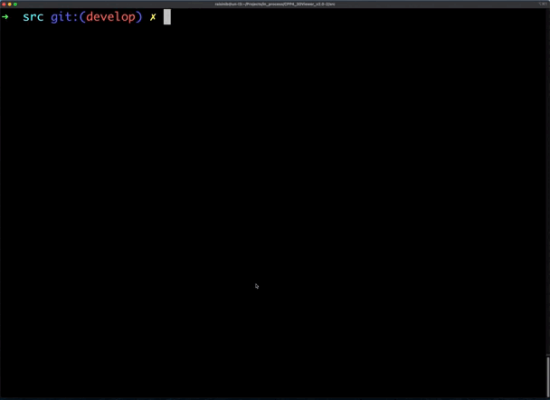

# 3DViewer v2.0

## Описание

#### Программа для визуализации каркасной модели в трехмерном пространстве

- Программа разработана на языке C++ стандарта C++17.
- Исходный код программы располагается в папке `src`.
- При написании кода используется стиль кодирования Google.
- Для сборки программы используется Makefile с стандартным набором целей: all, install, uninstall, clean, dvi, dist, tests.

1. **Программная архитектура**:
   - Программа разработана в соответствии с принципами объектно-ориентированного программирования.
   - Используется паттерн проектирования MVC (Model-View-Controller).
   - Код программы разделяется на модули, отвечающие за бизнес-логику (модели), визуальное представление (представления) и контроллеры.

2. **Функциональность программы**:
   - Загрузка каркасной модели из файла формата obj, поддерживающего только список вершин и поверхностей.
   - Возможность перемещения модели на заданное расстояние относительно осей X, Y, Z.
   - Возможность поворота модели на заданный угол относительно своих осей X, Y, Z.
   - Возможность масштабирования модели на заданное значение.




### Дополнительные настройки

1. **Тип проекции и параметры отображения**:
   - Программа позволяет настраивать тип проекции (параллельная и центральная).
   - Пользователь может настраивать тип ребер, а также способ отображения вершин.

2. **Настройки внешнего вида**:
   - Возможность выбора цвета фона.
   - Возможность выбора цвета и размера вершин.
   - Возможность выбора цвета и толщины ребер.

3. **Сохранение настроек**:
   - Настройки сохраняются между перезапусками программы.


### Дополнительная функциональность - Запись

1. **Сохранение изображений**:
   - Программа позволяет сохранять изображения моделей в файлы в форматах bmp и jpeg.

2. **Создание gif**:
   - Добавлена возможность записи gif - текущих пользовательских аффинных преобразований загруженного объекта
     в gif-анимацию (10fps, 5s).


## Требования к системе

- Операционная система: Linux или macOS
- C++17 compiler, cmake (версия 3.22 и выше)
- GUI-библиотека с API для C++17 (Qt)
- GTest library (для unit-тестов)

## Структура проекта

- `src/model/` - код библиотеки с логикой
- `src/controller/` - код контроллера
- `src/view/` - код графического интерфейса
- `src/tests` - unit-тесты для библиотек (GTest)
- `src/Makefile` - файл для сборки проекта

## Использование

Запустите программу:
```bash
cd ../src
make
```
